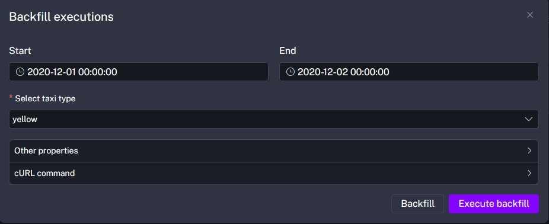

# How to start
- Create infrastructure for homework
```bash
docker compose up
```
- Use pgadmin for execution sql-queries (http://localhost:8080/browser/)

# Questions

## Question 1. Question 1. Within the execution for Yellow Taxi data for the year 2020 and month 12: what is the uncompressed file size (i.e. the output file yellow_tripdata_2020-12.csv of the extract task)?

```yml
commands:
    - wget -qO- https://github.com/DataTalksClub/nyc-tlc-data/releases/download/{{inputs.taxi}}/{{render(vars.file)}}.gz | gunzip > {{render(vars.file)}}
    - ls -lh {{render(vars.file)}}
    - file_size_bytes=$(wc -c < {{render(vars.file)}} | tr -d ' ')
    - echo "::{\"outputs\":{\"file_size_bytes\":${file_size_bytes}}}::"
```
You can see file size into 'file_size_bytes'


## Question 2. What is the rendered value of the variable file when the inputs taxi is set to green, year is set to 2020, and month is set to 04 during execution?

green_tripdata_2020-04.csv

## Question 3. How many rows are there for the Yellow Taxi data for all CSV files in the year 2020?

1) You need to load backfills from '2020-01-01 00:00:00' to '2020-12-02 00:00:00' for yellow taxi type.

2) Execute sql script:
```sql
select 
	count(1)
from
	public.yellow_tripdata
where
	filename like '%2020%'
```

## Question 4. How many rows are there for the Green Taxi data for all CSV files in the year 2020? 

1) You need to load backfills as 3.1 for green taxi type.
2) Execute sql script:
```sql
select 
	count(1)
from
	public.green_tripdata
where
	filename like '%2020%'
```

## Question 5. How many rows are there for the Yellow Taxi data for the March 2021 CSV file?

1) You need to load backfills from '2021-03-01 00:00:00' to '2021-03-02 00:00:00' as in 3.1 for yellow taxi type.
2) Execute sql script:
```sql
select 
	count(1)
from
	public.yellow_tripdata
where
	filename like '%2021-03%'
```

## Question 5. How many rows are there for the Yellow Taxi data for the March 2021 CSV file?

timezone: America/New_York
```yml
triggers:
  - id: test
    type: io.kestra.plugin.core.trigger.Schedule
    cron: "* * * * *"
    timezone: America/New_York
```