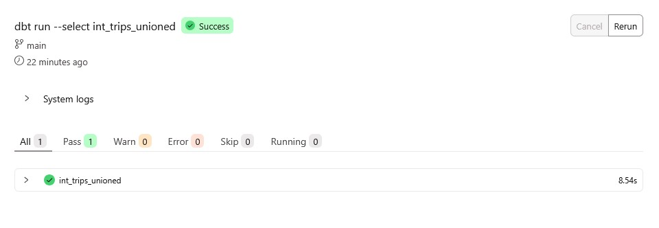
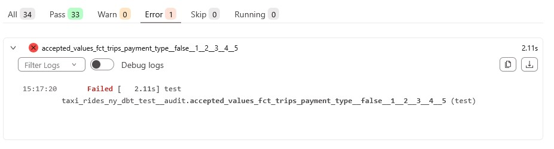
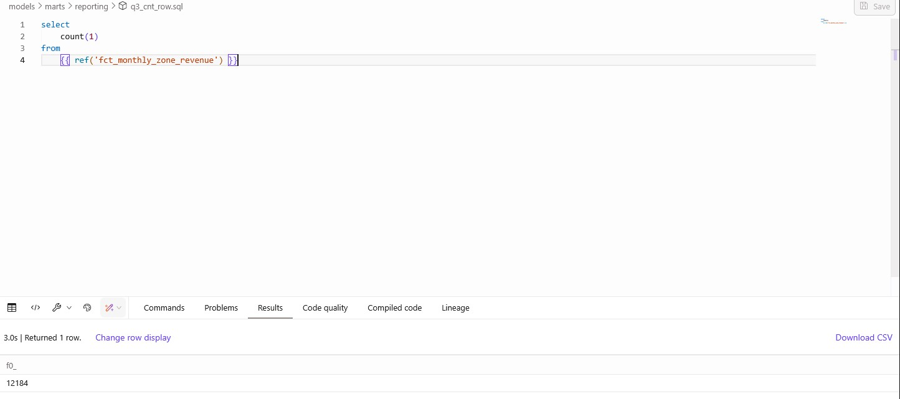
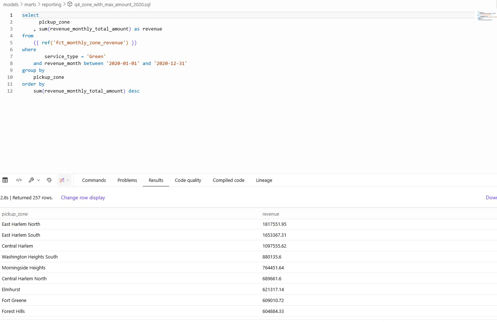
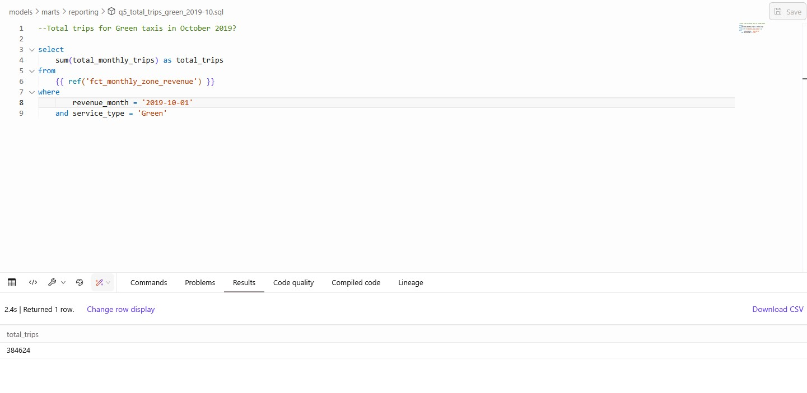

# How to start
- Install dependencies with uv and write env path value to gcp account
```bash
uv sync
echo "GOOGLE_APPLICATION_CREDENTIALS=''{path_to_your_cred_json''" > .env
```
- Run injestion script
```bash
uv run --env-file .env python load_data_to_bq.py
```

- Preparing table `greendata_trip` and `yellowdata_trip`
```sql
BEGIN

FOR uri IN (
  SELECT uri
  FROM UNNEST([
'gs://nytaxi-test/green/green_tripdata_2019-01.parquet',
'gs://nytaxi-test/green/green_tripdata_2019-02.parquet',
'gs://nytaxi-test/green/green_tripdata_2019-03.parquet',
'gs://nytaxi-test/green/green_tripdata_2019-04.parquet',
'gs://nytaxi-test/green/green_tripdata_2019-05.parquet',
'gs://nytaxi-test/green/green_tripdata_2019-06.parquet',
'gs://nytaxi-test/green/green_tripdata_2019-07.parquet',
'gs://nytaxi-test/green/green_tripdata_2019-08.parquet',
'gs://nytaxi-test/green/green_tripdata_2019-09.parquet',
'gs://nytaxi-test/green/green_tripdata_2019-10.parquet',
'gs://nytaxi-test/green/green_tripdata_2019-11.parquet',
'gs://nytaxi-test/green/green_tripdata_2019-12.parquet',
'gs://nytaxi-test/green/green_tripdata_2020-01.parquet',
'gs://nytaxi-test/green/green_tripdata_2020-02.parquet',
'gs://nytaxi-test/green/green_tripdata_2020-03.parquet',
'gs://nytaxi-test/green/green_tripdata_2020-04.parquet',
'gs://nytaxi-test/green/green_tripdata_2020-05.parquet',
'gs://nytaxi-test/green/green_tripdata_2020-06.parquet',
'gs://nytaxi-test/green/green_tripdata_2020-07.parquet',
'gs://nytaxi-test/green/green_tripdata_2020-08.parquet',
'gs://nytaxi-test/green/green_tripdata_2020-09.parquet',
'gs://nytaxi-test/green/green_tripdata_2020-10.parquet',
'gs://nytaxi-test/green/green_tripdata_2020-11.parquet',
'gs://nytaxi-test/green/green_tripdata_2020-12.parquet'


  ]) AS uri
)
DO

  EXECUTE IMMEDIATE FORMAT("""
      CREATE OR REPLACE EXTERNAL TABLE `nytaxi.green_tripdata_ext`
    OPTIONS (
      format = 'PARQUET',
      uris = ['%s']
    );

  """, uri.uri);

    insert into `nytaxi.green_tripdata`
    SELECT
      *
    FROM nytaxi.green_tripdata_ext;

END FOR;

END;

```
# Questions

# Q1


# Q2


## Q3
```sql
select 
    count(1)
from 
    {{ ref('fct_monthly_zone_revenue') }}
```


## Q4
```sql
select 
      pickup_zone
    , sum(revenue_monthly_total_amount) as revenue
from 
    {{ ref('fct_monthly_zone_revenue') }}
where 
        service_type = 'Green'
    and revenue_month between '2020-01-01' and '2020-12-31'
group by 
    pickup_zone
order by 
    sum(revenue_monthly_total_amount) desc
```



## Q5
```sql
--Total trips for Green taxis in October 2019?

select 
    sum(total_monthly_trips) as total_trips
from 
    {{ ref('fct_monthly_zone_revenue') }}
where 
        revenue_month = '2019-10-01'
    and service_type = 'Green'
```


## Q6
To be continue