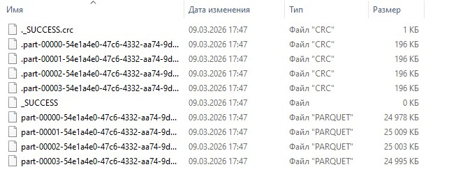
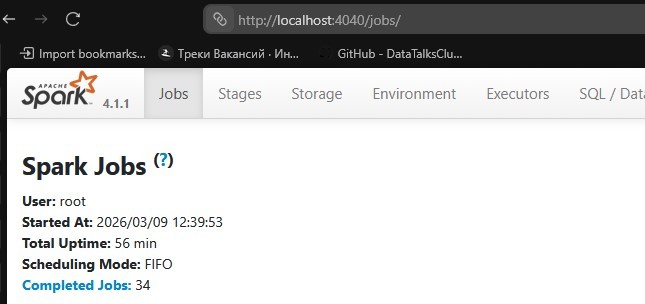

# How to start
- Create infrastructure for homework
```bash
docker compose up
```
- Use jupyter notebook for execution sql-queries (http://localhost:8888/lab/tree/notebooks/Untitled.ipynb)

# Questions

## Q1 Execute spark.version. What's the output?

'4.1.1'

## Q2 Yellow November 2025

```python
# Q2
dataset = spark.read.parquet('yellow_tripdata_2025-11.parquet') taxi_zone_lookup.csv
dataset \
        .repartition(4) \
        .write.parquet('./test_dir')
```


## Question 3. How many taxi trips were there on the 15th of November?

```python
#Q3
dataset.registerTempTable('trips_data')

spark.sql("""
    select
        count(1)
    from
        trips_data
    where
            tpep_pickup_datetime >= '2025-11-15 00:00:00'
        and tpep_pickup_datetime < '2025-11-16 00:00:00'
""").show()
```

## Question 4. What is the length of the longest trip in the dataset in hours?

```python
# Q4
spark.sql("""
    select
        max(
            (
                bigint(
                    to_timestamp(tpep_dropoff_datetime)
                )
                - bigint(
                    to_timestamp(tpep_pickup_datetime)
                )
            ) 
                / 3600
        ) as trip_length
    from
        trips_data
""").show()
```

## Question 5. Spark's User Interface which shows the application's dashboard runs on which local port?



## Question 6. Using the zone lookup data and the Yellow November 2025 data, what is the name of the LEAST frequent pickup location Zone?

```python
# Q6
zone = spark.read.option("header", "true").csv('taxi_zone_lookup.csv')
zone.registerTempTable('zone')
spark.sql("""
    select
          z.Zone
        , count(1)
    from
        trips_data as td
    left join 
        zone as z
            on z.LocationID = td.PULocationID
    group by 
        z.Zone
    order by 
        count(1) asc
    limit 10
""").show()
```