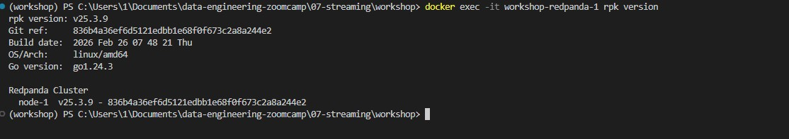
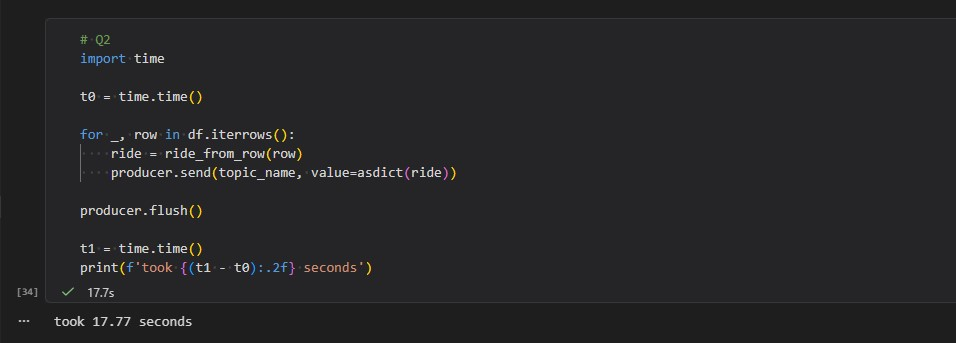
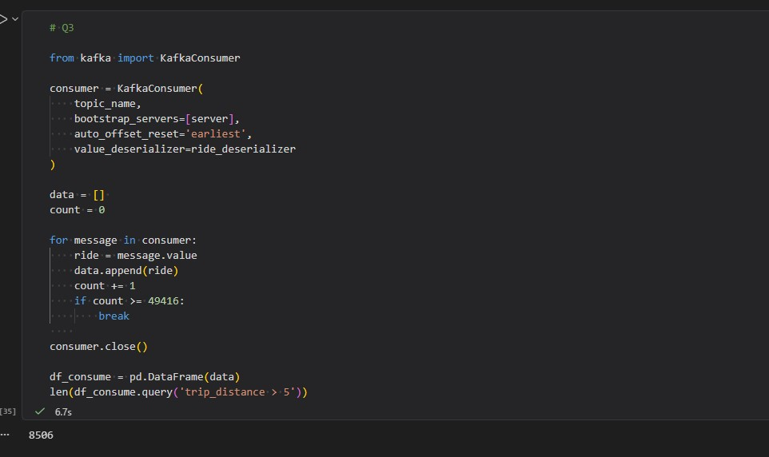
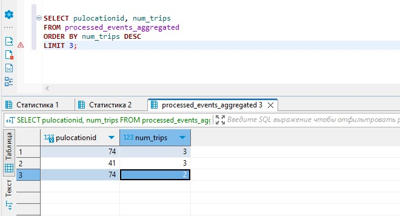

# How to start
- Create infrastructure for homework
```bash
docker compose up --build -d
```
- Use jupyter notebook file `send_data.ipynb`. It's include q1-q3 and data producing which needs to q4-q6
```bash
uv sync
uv run jupyter notebook
```
# Questions

## Question 1. Redpanda version




## Question 2. Sending data to Redpanda

Execute `#Q2` block in `send_data.ipynb`



## Question 3. Consumer - trip distance

Execute `#Q3` block in `send_data.ipynb`



## Question 4. Tumbling window - pickup location

### 1. Create postgres table
```sql
CREATE TABLE IF NOT EXISTS processed_events_aggregated (
    window_start TIMESTAMP(3) NOT NULL,
    pulocationid INTEGER NOT NULL,
    num_trips BIGINT,
    PRIMARY KEY (window_start, pulocationid)
);
```
### 2. Execute loader
```bash
docker exec -it workshop-jobmanager-1 flink run -py /opt/src/job/q4.py
```
### 3. Execute sql-script
```sql
select 
      pulocationid
    , num_trips
from 
    processed_events_aggregated
order by
    num_trips desc
limit 3
```


## Question 5. Session window - longest streak

### 1. Create table
```sql
CREATE TABLE IF NOT EXISTS processed_events_aggregated_2 (
    window_start TIMESTAMP(3) NOT NULL,
    pulocationid INTEGER NOT NULL,
    num_trips BIGINT,
    PRIMARY KEY (window_start, pulocationid)
);
```
### 2. Execute loader
```bash
docker exec -it workshop-jobmanager-1 flink run -py /opt/src/job/q5.py
```
### 3. Execute sql-script
```sql
select 
	  pulocationid
	, num_trips
from 
	processed_events_aggregated
order by
	num_trips desc
```

## Question 6. Tumbling window - largest tip

### 1. Create table
```sql
CREATE TABLE IF NOT EXISTS processed_events_aggregated_3 (
    window_start TIMESTAMP(3) NOT NULL,
    total_tip_amount FLOAT NOT NULL,  -- Обратите внимание на регистр!
    PRIMARY KEY (window_start)
);
```
### 2. Execute loader
```bash
docker exec -it workshop-jobmanager-1 flink run -py /opt/src/job/q6.py
```
### 3. Execute sql-script
```sql
select
      top 1
      window_start
    , total_tip_amount
from
    public.processed_events_aggregated_3 
order by 
    total_tip_amount desc
```